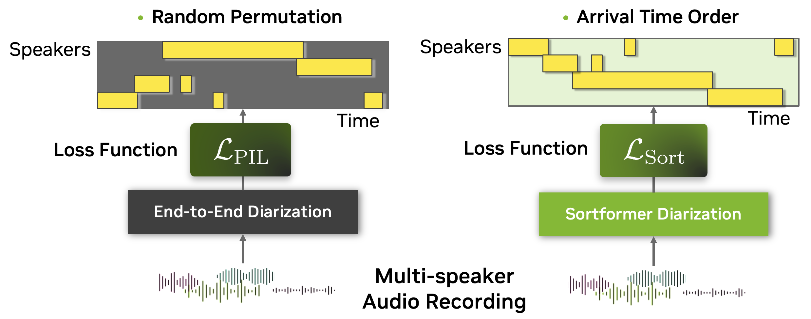
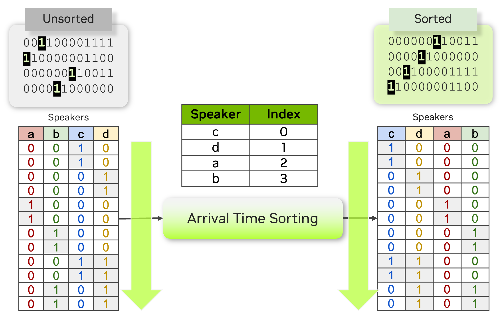
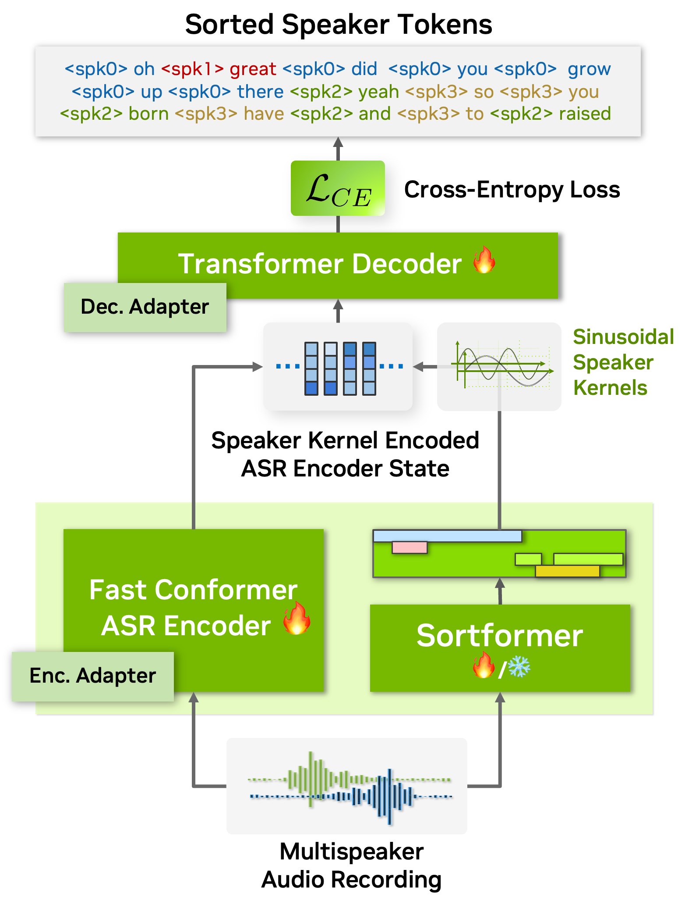
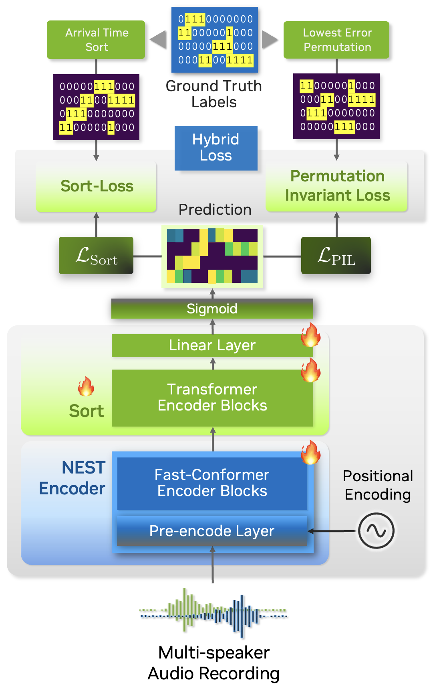
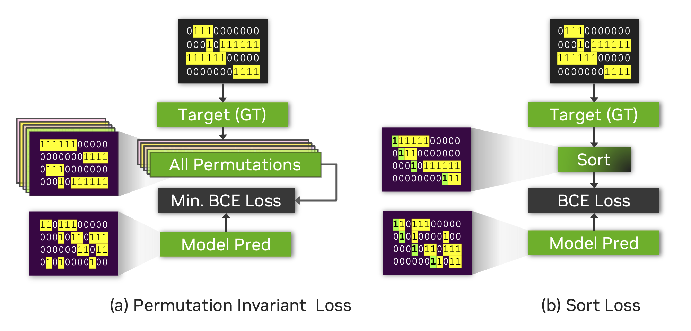
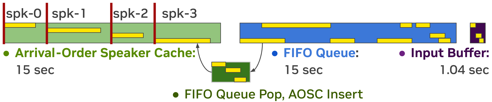
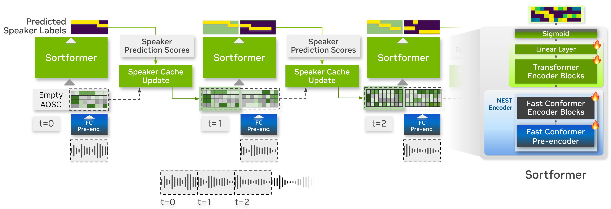

Models
======

This section gives a brief overview of the supported speaker diarization models in NeMo's ASR collection.

Currently NeMo Speech AI supports two types of speaker diarization systems:

1. **End-to-end Speaker Diarization:** Sortformer Diarizer 

Sortformer is a Transformer encoder-based end-to-end speaker diarization model that generates predicted speaker labels directly from input audio clips. 
We offer offline and online versions of Sortformer Diarizer. Online version of Sortformer diarizer can also be used for offline diarization by setting a long enough chunk size.

2. **Cascaded (Pipelined) Speaker Diarization:** Clustering diarizer

The clustering-based speaker diarization pipeline in NeMo Speech AI involves the use of the :doc:`MarbleNet <../speech_classification/models>` model for Voice Activity Detection (VAD) and the :doc:`TitaNet <../speaker_recognition/models>` model for speaker embedding extraction, followed by spectral clustering.

.. _Sortformer Diarizer:

Sortformer Diarizer
-------------------
Speaker diarization is all about figuring out who's speaking when in an audio recording. In the world of automatic speech recognition (ASR), this becomes even more important for handling conversations with multiple speakers. Multispeaker ASR (also known as speaker-attributed or multitalker ASR) uses this process to not just transcribe what's being said, but also to label each part of the transcript with the right speaker.

As ASR technology continues to advance, speaker diarization is increasingly becoming part of the ASR workflow itself. Some systems now handle speaker labeling and transcription at the same time during decoding. This means you not only get accurate text—you're also getting insights into who said what, making it more useful for conversational analysis.

However, despite significant advancements, integrating speaker diarization and ASR into a unified, seamless system remains a considerable challenge. A key obstacle lies in the need for extensive high-quality, annotated audio data featuring multiple speakers. Acquiring such data is far more complex than collecting monaural-speaker datasets. This challenge is particularly pronounced for low-resource languages and domains like healthcare, where strict privacy regulations further constrain data availability.

On top of that, many real-world use cases need these models to handle really long audio files—sometimes hours of conversation at a time. Training on such lengthy data is even more complicated because it's hard to find or annotate. This creates a big gap between what's needed and what's available, making multispeaker ASR one of the toughest nuts to crack in the field of speech technology.

To tackle the complexities of multispeaker automatic speech recognition (ASR), we introduce `Sortformer <https://arxiv.org/abs/2409.06656>`__, a new approach that incorporates *Sort Loss* and techniques to align timestamps with text tokens. Traditional approaches like permutation-invariant loss (PIL) face challenges when applied in batchable and differentiable computational graphs, especially since token-based objectives struggle to incorporate speaker-specific attributes into PIL-based loss functions.

To address this, we propose an arrival time sorting (ATS) approach. In this method, speaker tokens from ASR outputs and speaker timestamps from diarization outputs are sorted by their arrival times to resolve permutations. This approach allows the multispeaker ASR system to be trained or fine-tuned using token-based cross-entropy loss, eliminating the need for timestamp-based or frame-level objectives with PIL.

The ATS-based multispeaker ASR system is powered by an end-to-end neural diarizer model, Sortformer, which generates speaker-label timestamps in arrival time order (ATO). To train the neural diarizer to produce sorted outputs, we introduce Sort Loss, a method that creates gradients enabling the Transformer model to learn the ATS mechanism.

Additionally, as shown in the above figure, our diarization system integrates directly with the ASR encoder. By embedding speaker supervision data as speaker kernels into the ASR encoder states, the system seamlessly combines speaker and transcription information. This unified approach improves performance and simplifies the overall architecture.

As a result, our end-to-end multispeaker ASR system is fully or partially trainable with token objectives, allowing both the ASR and speaker diarization modules to be trained or fine-tuned using these objectives. Additionally, during the multispeaker ASR training phase, no specialized loss calculation functions are needed when using Sortformer, as frameworks for standard single-speaker ASR models can be employed. These compatibilities greatly simplify and accelerate the training and fine-tuning process of multispeaker ASR systems.

On top of all these benefits, *Sortformer* can be used as a stand-alone end-to-end speaker diarization model. By training a Sortformer diarizer model especially on high-quality simulated data with accurate time-stamps, you can boost the performance of multi-speaker ASR systems, just by integrating the *Sortformer* model as *Speaker Supervision* model in a computation graph.

In this tutorial, we will walk you through the process of training a Sortformer diarizer model with toy dataset. Before starting, we will introduce the concepts of Sort-Loss calculation and the Hybrid loss technique.

*Sort Loss* is designed to compare the predicted outputs with the true labels, typically sorted in arrival-time order or another relevant metric. The key distinction that *Sortformer* introduces compared to previous end-to-end diarization systems such as `EEND-SA <https://arxiv.org/pdf/1909.06247>`__, `EEND-EDA <https://arxiv.org/abs/2106.10654>`__ lies in the organization of class presence :math:`\mathbf{\hat{Y}}`.

The figure below illustrates the difference between *Sort Loss* and permutation-invariant loss (PIL) or permutation-free loss.

- PIL is calculated by finding the permutation of the target that minimizes the loss value between the prediction and the target.

- *Sort Loss* simply compares the arrival-time-sorted version of speaker activity outputs for both the prediction and the target. Note that sometimes the same ground-truth labels lead to different target matrices for *Sort Loss* and PIL.

For example, the figure below shows two identical source target matrices (the two matrices at the top), but the resulting target matrices for *Sort Loss* and PIL are different.

.. _Streaming Sortformer Diarizer:

Streaming Sortformer Diarizer
-----------------------------

`Streaming Sortformer <https://www.arxiv.org/pdf/2507.18446>`__ is a streaming version of Sortformer diarizer. To handle live audio, Streaming Sortformer processes the sound in small, overlapping chunks. It employs an Arrival-Order Speaker Cache (AOSC) that stores frame-level acoustic embeddings for all speakers previously detected in the audio stream. This allows the model to compare speakers in the current chunk with those in the previous ones, ensuring a person is consistently identified with the same label throughout the stream.

Streaming Sortformer employs a pre-encoder layer in the Fast-Conformer to generate a speaker cache. At each step, speaker cache is filtered to only retain the high-quality speaker cache vectors. Aside from speaker-cache management part, Streaming Sortformer follows the architecture of the offline version of Sortformer.

Below is the animated heatmap illustrating real-time speaker diarization for a three-speaker conversation using Streaming Sortformer. The heatmap shows how activities of speakers are detected in the current chunk and updated in the Arrival-Order Speaker Cache and FIFO queue.

.. image:: images/aosc_3spk_example.gif
        :align: center
        :width: 800px
        :alt: Streaming Sortformer Animated

References
-----------

.. bibliography:: ../asr_all.bib
    :style: plain
    :labelprefix: SD-MODELS
    :keyprefix: sd-models-
